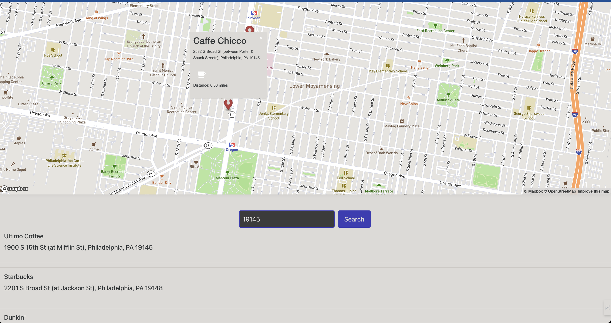

# MochaMaps

MochaMaps is a React application that allows users to search for coffee shops in a specific location. It uses Mapbox for location services and Foursquare for coffee shop data.

## Website

Explore MochaMaps on the web: [**MochaMaps Website**](https://mochamaps.netlify.app/)

## Features

- Search for coffee shops by entering a location or zip code
- View coffee shops on a map
- Click on a coffee shop to view more details



## Installation

1. Clone the repository:

```
git clone https://github.com/yourusername/mochamaps.git
```

2. Navigate to the client directory:

```
cd mochamaps/client
```

3. Install the dependencies:

```
npm install
```

## Configuration

Create a `.env` file in the client directory and add your Mapbox and Foursquare API keys:

```
VITE_APP_MAPBOX_API_KEY="your_mapbox_api_key"
VITE_APP_FOURSQUARE_API_KEY="your_foursquare_api_key"
```

## Running the Application

To start the application, run the following command in the client directory:

```
npm run dev
```

The application will be available at http://localhost:3000.

## Contributing

Pull requests are welcome. For major changes, please open an issue first to discuss what you would like to change.

## License

MIT
